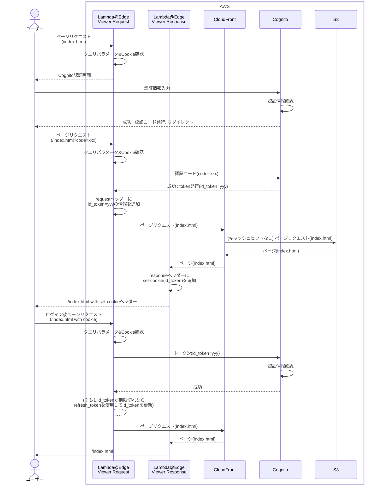

# AWS Cognito認証フロー図

この図は、AWS Cognitoを使用した認証フローのシーケンス図です。

## 説明

このシーケンス図は以下の認証フローを示しています：

1. **初期アクセス**: ユーザーがページにアクセス
2. **認証チェック**: Lambda@Edgeが認証状態を確認
3. **認証画面表示**: 未認証の場合、Cognito認証画面を表示
4. **認証処理**: ユーザーが認証情報を入力
5. **トークン取得**: 認証成功後、認証コードを取得
6. **トークン交換**: 認証コードをIDトークンに交換
7. **Cookie設定**: レスポンスヘッダーにCookieを設定
8. **継続アクセス**: 以降のアクセスではCookieを使用して認証

このフローにより、セキュアな認証システムを構築できます。